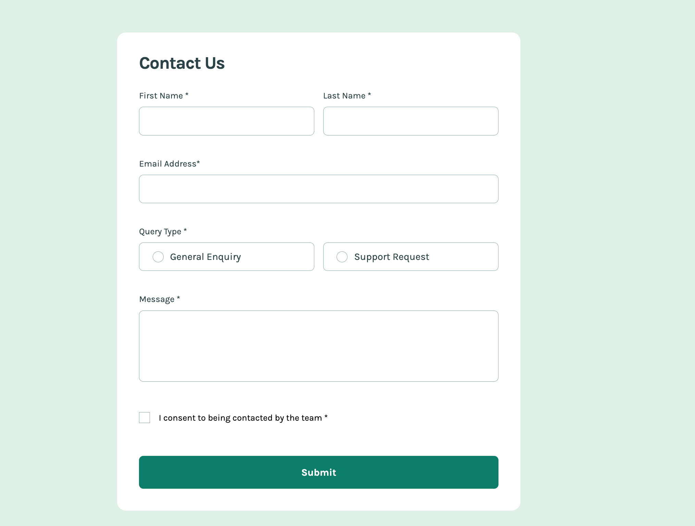

# Frontend Mentor - Contact form solution

This is a solution to the [Contact form challenge on Frontend Mentor](https://www.frontendmentor.io/challenges/contact-form--G-hYlqKJj). Frontend Mentor challenges help you improve your coding skills by building realistic projects.

## Table of contents

- [Frontend Mentor - Contact form solution](#frontend-mentor---contact-form-solution)
  - [Table of contents](#table-of-contents)
  - [Overview](#overview)
    - [The challenge](#the-challenge)
    - [Screenshot](#screenshot)
    - [Links](#links)
  - [My process](#my-process)
    - [Built with](#built-with)
    - [What I learned](#what-i-learned)
    - [Continued development](#continued-development)
    - [Useful resources](#useful-resources)
  - [Author](#author)

## Overview

### The challenge

Users should be able to:

-   Complete the form and see a success toast message upon successful submission
-   Receive form validation messages if:
    -   A required field has been missed
    -   The email address is not formatted correctly
-   Complete the form only using their keyboard
-   Have inputs, error messages, and the success message announced on their screen reader
-   View the optimal layout for the interface depending on their device's screen size
-   See hover and focus states for all interactive elements on the page

### Screenshot

### Links

-   Solution URL: [https://github.com/EmLopezDev/Contact-Form](https://github.com/EmLopezDev/Contact-Form)
-   Live Site URL: [https://emlopezdev.github.io/Contact-Form/](https://emlopezdev.github.io/Contact-Form/)

## My process

### Built with

-   Semantic HTML5 markup
-   CSS custom properties
-   Flexbox
-   Mobile-first workflow
-   JavaScript

### What I learned

-   I learded a little more on validation, although I feel I could have implemented it better this is whatr I came up with. Hopefully I can get some good feedback on it.
-   Learned about the `:has()` selector in CSS.
-   Learned a cool way to add a toast

### Continued development

-   I do want to continue doing forms specifically validation on form. I want to get better at it and find a better solution.

### Useful resources

-   [Regex](https://regex101.com/) - This helped write out and test regex.

## Author

-   Frontend Mentor - [@EmLopezDev](https://www.frontendmentor.io/profile/EmLopezDev)
